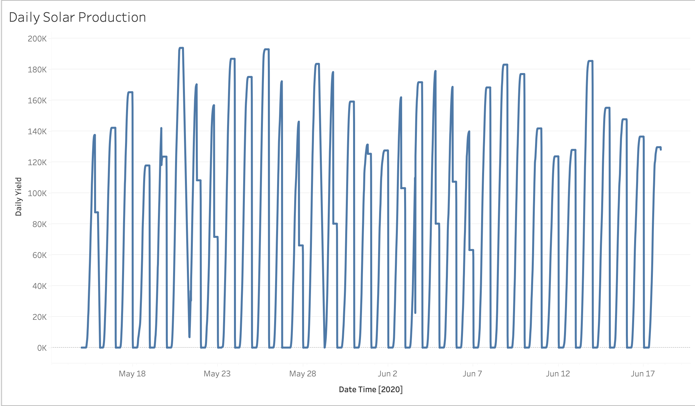
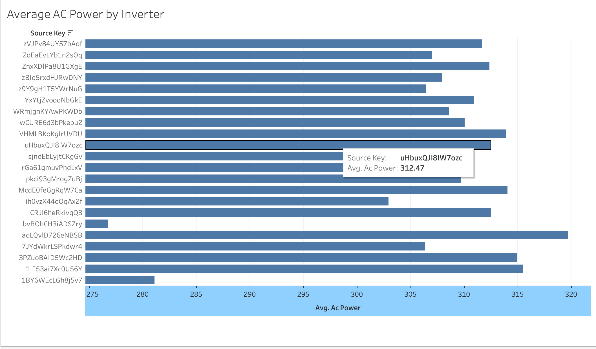
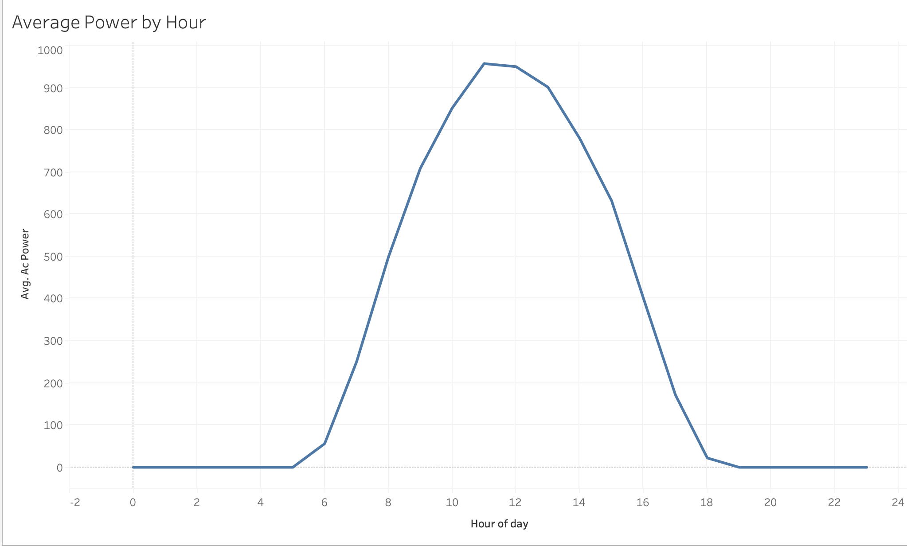

# End-to-End Data Engineering Pipeline for Renewable Energy Data Quality and Analytics

An end-to-end Data Engineering project that processes renewable energy generation data using Python, PostgreSQL, SQL, and Tableau.

The project demonstrates how raw solar sensor data can be extracted, cleaned, validated, stored in a relational database, analyzed with SQL, and visualized through an interactive analytics dashboard.

---

## Tech Stack

- Python
- Pandas
- PostgreSQL
- SQLAlchemy
- SQL
- Tableau Public
- Git & GitHub

---

## Project Architecture

```text
                Raw Solar CSV
                      │
                      ▼
              Python ETL Pipeline
          (Extract • Transform • Load)
                      │
                      ▼
          Data Cleaning & Validation
                      │
                      ▼
             PostgreSQL Database
                      │
                      ▼
               SQL Analytics Layer
                      │
                      ▼
             Tableau Dashboard
```

## Features

- Built an end-to-end ETL pipeline for renewable energy sensor data.
- Extracted raw solar generation data using Python and Pandas.
- Cleaned and validated sensor readings through a transformation pipeline.
- Stored processed data in a PostgreSQL relational database.
- Designed a normalized database schema for solar measurements.
- Queried production metrics using SQL.
- Exported analytics-ready datasets for business intelligence reporting.
- Created interactive Tableau dashboards to visualize solar plant performance.
- Used Git and GitHub for version control throughout development.


## Repository Structure

```text
solar-energy-data-pipeline/

│── data/
│   ├── raw/
│   └── processed/
│
│── dashboards/
│
│── sql/
│   ├── schema.sql
│   └── analysis_queries.sql
│
│── src/
│   ├── extract.py
│   ├── transform.py
│   ├── load.py
│   └── export_dashboard_data.py
│
│── README.md
│── requirements.txt
│── .gitignore
```

## Project Highlights

- **Programming Language:** Python
- **Database:** PostgreSQL
- **Visualization:** Tableau Public
- **Records Processed:** ~68,000+ solar sensor readings
- **ETL Stages:** Extract → Transform → Load
- **Focus Areas:** Data Engineering, SQL Analytics, Data Quality, Renewable Energy

## Dashboard Preview

### Solar Energy Production Over Time

Shows changes in solar energy generation over time and helps identify production trends.



---

### Average AC Power by Inverter

Compares the average AC power generated by each inverter to identify performance differences.



---

### Average Power by Hour

Visualizes the typical daily solar production cycle, highlighting peak generation around midday.



## ETL Pipeline

The project follows a traditional Extract, Transform, Load (ETL) workflow.

### Extract

- Reads raw solar generation data from CSV files.

### Transform

- Standardizes column names.
- Converts timestamps into datetime objects.
- Removes duplicate records.
- Validates power measurements.
- Creates a conversion efficiency metric.
- Handles missing and invalid values.

### Load

- Loads validated data into PostgreSQL.
- Executes SQL queries for analytics.
- Exports dashboard-ready datasets for Tableau.

## Installation

### 1. Clone the repository

```bash
git clone https://github.com/km06653/Solar-Energy-Pipeline.git
```

```bash
cd Solar-Energy-Pipeline
```

### 2. Create a virtual environment

```bash
python3 -m venv venv
```

Activate it:

macOS/Linux

```bash
source venv/bin/activate
```

Windows

```bash
venv\Scripts\activate
```

### 3. Install dependencies

```bash
pip install -r requirements.txt
```

### 4. Install PostgreSQL

Install PostgreSQL locally and create a database named:

```text
solar_energy
```

### 5. Configure environment variables

Create a `.env` file:

```text
DB_NAME=solar_energy
DB_USER=your_username
DB_PASSWORD=your_password
DB_HOST=localhost
DB_PORT=5432
```

### 6. Run the ETL Pipeline

```bash
python src/extract.py
```

```bash
python src/transform.py
```

```bash
python src/load.py
```

### 7. Export dashboard data

```bash
python src/export_dashboard_data.py
```

## Future Improvements

- Integrate weather sensor data with solar generation data.
- Build automated pipeline scheduling using Apache Airflow.
- Containerize the application with Docker.
- Deploy the database and ETL pipeline to AWS.
- Replace CSV ingestion with API-based data collection.
- Add automated unit and integration tests.
- Create interactive dashboards using live PostgreSQL connections.

## Lessons Learned

Through this project I gained hands-on experience with:

- Designing modular ETL pipelines.
- Cleaning and validating real-world datasets.
- Building relational database schemas.
- Writing analytical SQL queries.
- Connecting Python applications to PostgreSQL.
- Creating business intelligence dashboards.
- Managing software projects using Git and GitHub.

## License

This project is intended for educational and portfolio purposes.

